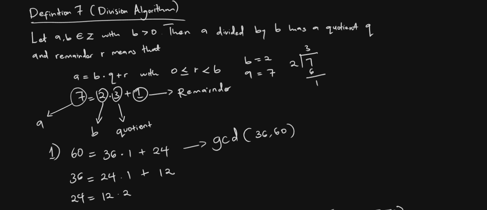
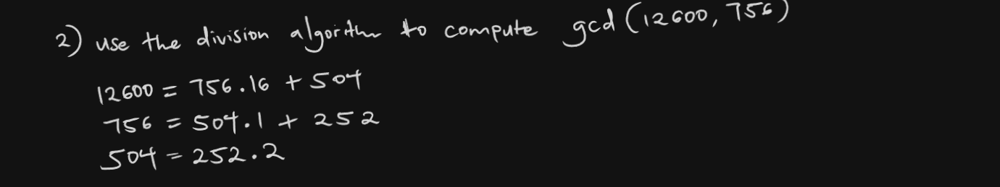

# Euclidean Algorithm in Rust

This Rust program calculates the Greatest Common Divisor (GCD) of two numbers using the Euclidean algorithm.

## How It Works

The Euclidean Algorithm, allows us to compute the GCD of numbers without factoring, which is a useful algorithm in number theory

### 1. Division Algorithm Definition

The image starts with Definition 7, which outlines the division algorithm:

- For integers a, b ∈ Z with b > 0
- a divided by b has a quotient q and remainder r
- Expressed as: a = b * q + r, where 0 ≤ r < b

### 2. Simple Division Example

There's a quick example:
7 ÷ 2 = 3 remainder 1
Mathematically: 7 = 2 * 3 + 1

### 3. GCD Calculation using Euclidean Algorithm

The main part shows how to find GCD(36, 60):

1. 60 = 36 * 1 + 24
2. 36 = 24 * 1 + 12
3. 24 = 12 * 2 + 0

### 4. Walkthrough

1. We start with 60 and 36
2. Divide the larger by the smaller
3. Take the remainder (24) and use it to divide the previous divisor (36)
4. Repeat until we get a remainder of 0
5. The last non-zero remainder (12) is our GCD

#### Key Takeaway
This method is efficient because each step reduces the numbers we're working with. The algorithm guarantees we'll eventually reach a remainder of 0, and the last non-zero remainder is always the GCD of our original numbers.

#### For Example 


- The GCD here is 12

##### it is especially efficient in larger numbers compared to other algorithms like Long Division


## Example Rust Implementation

```rust
fn main() {
    println!("Enter First Number: ");
    let mut input = String::new();
    std::io::stdin().read_line(&mut input).expect("Failed to read line");
    let first_num: i32 = input.trim().parse().expect("Please enter a number");

    println!("Enter Second Number: ");
    let mut input = String::new();
    std::io::stdin().read_line(&mut input).expect("Failed to read line");
    let second_num: i32 = input.trim().parse().expect("Please enter a number");

    // Call the function to compute the GCD
    get_gcd(first_num, second_num);
}

fn get_gcd(num_one: i32, num_two: i32) -> i32 {
    let mut gcd_a = num_one;
    let mut gcd_b = num_two;

    if gcd_b > gcd_a {
        let mut divider = (gcd_b / gcd_a) as i32;
        let mut remainder = gcd_b - (gcd_a * divider);
        while remainder != 0 {
            gcd_b = gcd_a;
            gcd_a = remainder;
            divider = (gcd_b / gcd_a) as i32;
            remainder = gcd_b - (gcd_a * divider);
        }
        println!(" The GCD of {} and {} is {}", num_one, num_two, gcd_a);
        return gcd_a;
    } else if gcd_b < gcd_a {
        let mut divider = (gcd_a / gcd_b) as i32;
        let mut remainder = gcd_a - (gcd_b * divider);
        while remainder != 0 {
            gcd_a = gcd_b;
            gcd_b = remainder;
            divider = (gcd_a / gcd_b) as i32;
            remainder = gcd_a - (gcd_b * divider);
        }
        println!(" The GCD of {} and {} is {}", num_one, num_two, gcd_b);
        return gcd_b;
    } else {
        println!("numbers may not have a GCD");
        return 0;
    }
}
```