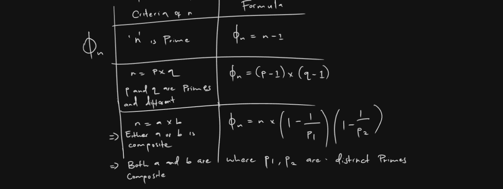

# Euler's Totient Function in Rust

This Rust project calculates the Euler's Totient function `φ(n)`, which is used to determine the number of integers up to `n` that are coprime (i.e., relatively prime) to `n`.

## How It Works

The Euler's Totient function, `φ(n)`, is defined as the number of integers less than `n` that are coprime with `n`. The implementation is divided into different cases depending on whether `n` is prime, a product of two distinct primes, or a general composite number.

### Cases Handled

1. **`n` is Prime:**
    - If `n` is a prime number, the function returns `n - 1`. This is because all integers less than a prime number `n` are coprime with it.
    - **Formula:** `φ(n) = n - 1`

2. **`n` is a Product of Two Distinct Primes:**
    - If `n` is a product of two distinct primes `p1` and `p2`, the function returns `(p1 - 1) * (p2 - 1)`.
    - **Formula:** `φ(n) = (p1 - 1) * (p2 - 1)`

3. **General Case (Composite `n`):**
    - For general composite numbers, the function iteratively multiplies the result by `(1.0 - (1.0 / p))` for each distinct prime factor `p` of `n`.
    - **Formula:** `φ(n) = n * (1 - 1/p1) * (1 - 1/p2) * ...`

#### For Example
1. Find ∅(5)

- This is easy for simple numbers we can use the guideline


- for example:


## Example Rust Implementation
```rust
use crate::prime::prime::is_prime;
use crate::prime_factorization::prime_factor::get_prime_factors;

mod prime;
mod prime_factorization;

fn main() {
    find_eulers_totient(372);
}

fn find_eulers_totient(n: u64) -> u64 {
    let mut prime_factors: Vec<u64>= Vec::new();
    let mut factors: Vec<u64>= get_prime_factors(n).into_iter().filter(|&x| {
        if prime_factors.contains(&x) {
            false
        } else {
            prime_factors.push(x);
            true
        }
    }).collect();

    if is_prime(n) {
        println!("Euler's Totient is {:?}", n - 1);
        n - 1
    } else if factors.len() == get_prime_factors(n).len(){
        let mut totient: u64 = 1;
        for element in prime_factors {
            totient *= element - 1;
        }
        println!("Euler's Totient is {}", totient);
        totient
    } else {
        let mut result = n as f64;
        for element in prime_factors {
            result *= 1.0 - (1.0 / element as f64);
        }
        println!("Euler's Totient is {}", result as u64);
        result as u64
    }
}
```

## Example Usage

### To find the Euler's Totient for 372, run the program:

```shell
cargo run
```

### Output
```markdown
Euler's Totient is 120
```

#### Explanation
- Prime Check: The is_prime function is used to check if n is a prime number.
- Prime Factorization: The get_prime_factors function returns the prime factors of n.
- Totient Calculation: Depending on whether n is prime or composite, the totient is calculated using different approaches as described above.

#### Dependencies
This project relies on custom modules for:
- Prime Number Check: `prime::is_prime`
- Prime Factorization: `prime_factorization::get_prime_factors`

Make sure these modules are implemented and properly imported in your project.

#### License
This project is licensed under the MIT License.
