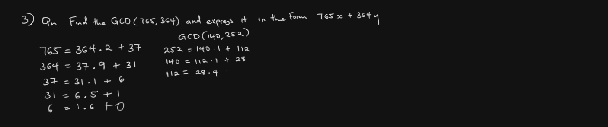
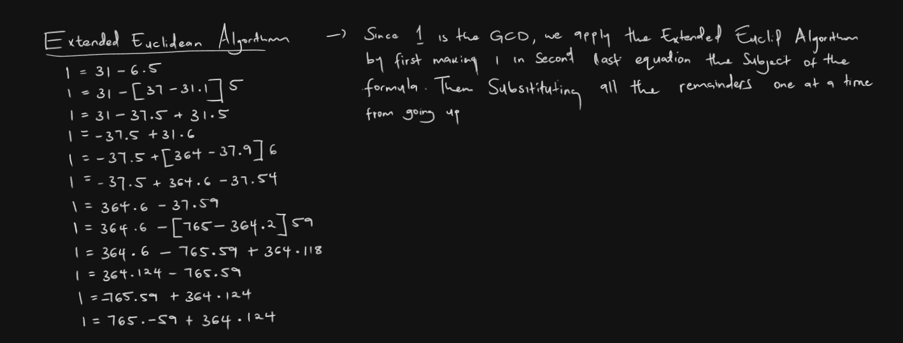

# Extended Euclidean Algorithm in Rust

This Rust program calculates the Greatest Common Divisor (GCD) of two numbers using the Euclidean algorithm.

## How It Works


The Extended Euclidean Algorithm is an extension of the Euclidean Algorithm, which is used to find the Greatest Common Divisor (GCD) of two integers. The Extended Euclidean Algorithm not only finds the GCD of two integers but also provides coefficients (often called Bézout coefficients) that can express the GCD as a linear combination of the two integers. Specifically, it finds integers
𝑥
x and
𝑦
y such that:

```markdown
GCD(a, b) = ax + by
```

## What Does the Extended Euclidean Algorithm Allow Us to Do?

1. **Compute Bézout's Identity**: The algorithm provides the integers \( x \) and \( y \) such that \( ax + by = GCD(a, b) \). This is useful in number theory and cryptography.

2. **Find Multiplicative Inverses**: If \( a \) and \( b \) are coprime (i.e., \( GCD(a, b) = 1 \)), the algorithm can find the multiplicative inverse of \( a \) modulo \( b \). This is because \( ax ≡ 1  (mod b) \) implies that \( x \) is the multiplicative inverse of \( a \) modulo \( b \).

3. **Solve Linear Diophantine Equations**: The Extended Euclidean Algorithm can solve equations of the form \( ax + by = c \), where \( c \) is a multiple of the GCD of \( a \) and \( b \). If \( c \) is not a multiple of the GCD, no solution exists.

4. **Used in Cryptography**: It is fundamental in algorithms like RSA for key generation and decryption, where finding modular inverses is essential.

#### For Example


1. We will first find the GCD using the Euclidean algorithm
2. Then since 1 is the GCD, we apply the Extended Euclid Algorithm by making 1 in the second last equation the subject of the formula. Then substituting all the remainders one at a time going up.



## Example Rust Implementation

```rust
fn main() {
    println!("Enter First Number: ");
    let mut input = String::new();
    std::io::stdin().read_line(&mut input).expect("Failed to read line");
    let first_num: i32 = input.trim().parse().expect("Please enter a number");

    println!("Enter Second Number: ");
    let mut input = String::new();
    std::io::stdin().read_line(&mut input).expect("Failed to read line");
    let second_num: i32 = input.trim().parse().expect("Please enter a number");

    // Call the function to compute the GCD
    get_gcd(first_num, second_num);
}

fn get_gcd(num_one: i32, num_two: i32) -> i32 {
    let mut gcd_a = num_one;
    let mut gcd_b = num_two;

    if gcd_b > gcd_a {
        let mut divider = (gcd_b / gcd_a) as i32;
        let mut remainder = gcd_b - (gcd_a * divider);
        while remainder != 0 {
            gcd_b = gcd_a;
            gcd_a = remainder;
            divider = (gcd_b / gcd_a) as i32;
            remainder = gcd_b - (gcd_a * divider);
        }
        println!(" The GCD of {} and {} is {}", num_one, num_two, gcd_a);
        return gcd_a;
    } else if gcd_b < gcd_a {
        let mut divider = (gcd_a / gcd_b) as i32;
        let mut remainder = gcd_a - (gcd_b * divider);
        while remainder != 0 {
            gcd_a = gcd_b;
            gcd_b = remainder;
            divider = (gcd_a / gcd_b) as i32;
            remainder = gcd_a - (gcd_b * divider);
        }
        println!(" The GCD of {} and {} is {}", num_one, num_two, gcd_b);
        return gcd_b;
    } else {
        println!("numbers may not have a GCD");
        return 0;
    }
}
```