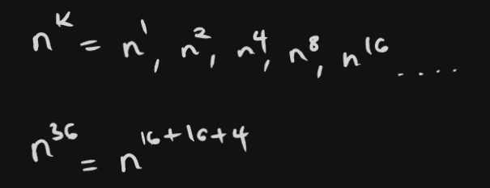
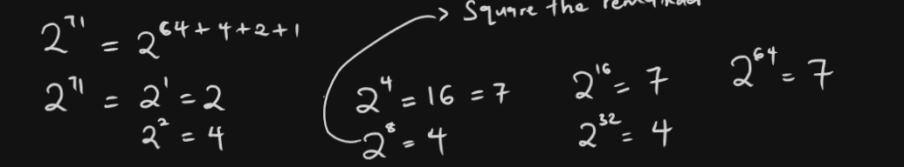
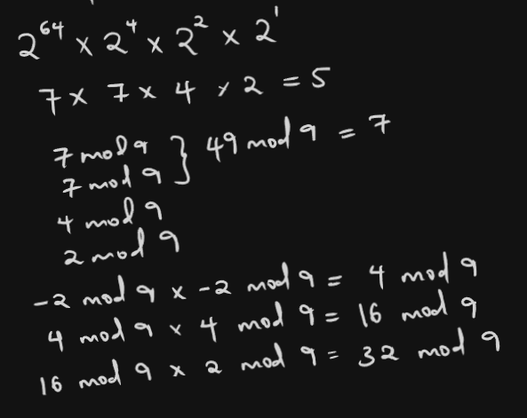
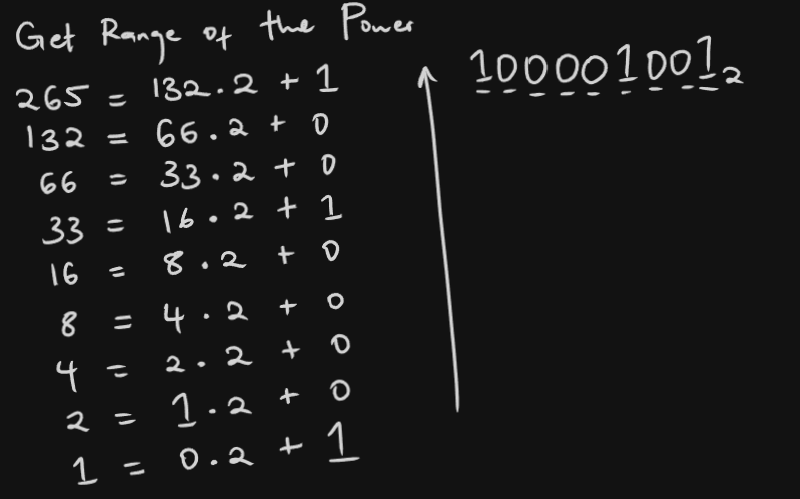
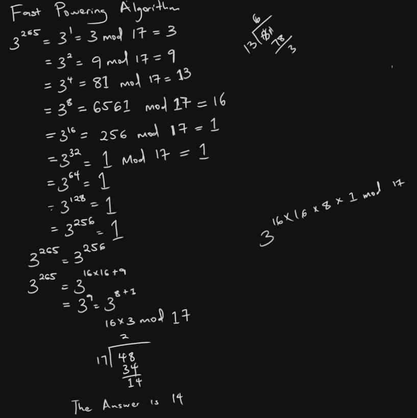

### Fast Powering Algorithm in Rust

- also known as exponentiation by squaring algorithm.
is a technique used to efficiently compute the power of a number, especially in modular arithmetic.

- This algorithm greatly reduces the number of multiplications needed compared to the straight forward method of multiplying the base by itself repeatedly.

it works as follows:
    


#### Example 27
Find 2⁷¹ mod 9

    2⁷¹ = 2⁶⁴⁺⁴⁺²⁺¹


Then substitute the squared bases



#### Example 28
Find 3²⁶⁵ mod 17

1. Get Range of the Power

2. Compute Fast Powering Algorithm


#### Rust implementation

```rust
fn mod_exp(mut base: u128, mut exp: u128, modulus: u128) -> u128 {
    if modulus == 1 {
        return 0;
    }
    let mut result = 1;
    base = base % modulus;
    while exp > 0 {
        if exp % 2 == 1 {
            result = (result * base) % modulus;
        }
        exp = exp >> 1;
        base = (base * base) % modulus;
    }
    result
}
```

1. `base = base % modulus` - This operation performs the modulo (remainder) operation on the base with respect to the modulus on the base with respect to the modulus.
    It's used to reduce the base to a smaller, equivalent value within the range of the modulus.
    
- If **base = 50 and modulus = 23**:
   50 % 23 = 4 (because 50 ÷ 23 = 2 remainder 4)
   base becomes 4.

2. `if exp % 2 == 1 {
   result = (result * base) % modulus;
   println!("Odd exp, new result: {}", result);
   }` - This part checks the bit of the exponent(in its binary representation) if it's 1, it updates the result.

- Suppose we're calculating 7^35 mod 27.
- 35 in binary is 10011
- initially:
  - result = 1
  - base = 7
  - exp = 35 (10011 in binary)
  - modulus = 27

- The algorithm will process the bits of the exponent from right to left.
    1. First iteration:
       exp = 35 (100011 in binary)
       35 % 2 = 1, so we enter the if block
       result = (1 * 7) % 27 = 7
    2. Second iteration:
       exp = 17 (10001 in binary)
       17 % 2 = 1, so we enter the if block
       result = (7 * 7) % 27 = 49 % 27 = 22
    3. Third iteration:
       exp = 8 (1000 in binary)
       8 % 2 = 0, so we skip the if block
       result stays 22
    4. Fourth iteration:
       exp = 4 (100 in binary)
       4 % 2 = 0, so we skip the if block
       result stays 22
    5. Fifth iteration:
       exp = 2 (10 in binary)
       2 % 2 = 0, so we skip the if block
       result stays 22
    6. Sixth (final) iteration:
       exp = 1 (1 in binary)
       1 % 2 = 1, so we enter the if block
       result = (22 * 7) % 27 = 154 % 27 = 19
  
    - The final result is 19

3. `exp = exp >> 1; base = (base * base) % modulus;` - This performs a bitwise right shift on the exponent. It's equivalent to diving the exponent by 2 and discarding any remainder
    - Examples:
      - If exp is 35 (100011 in binary), after this operation it becomes 17 (10001 in binary)
      - If exp is 8 (1000 in binary), it becomes 4 (100 in binary)

4. `base = (base * base) % modulus; ` - This line squares the base and then takes the modulus
    - if base is 7: (7*7) % 27 = 49 % 27 = 22
    - If base is 22: (22 * 22) % 27 = 484 % 27 = 25
- This operation computes the next power of the base, modulo the given modulus. This approach allows the algorithm to efficiently compute large powers by repeatedly squaring the base and selectively multiplying the result (in the if exp % 2 == 1 block) based on the bits of the exponent.
5. We will return the result. 