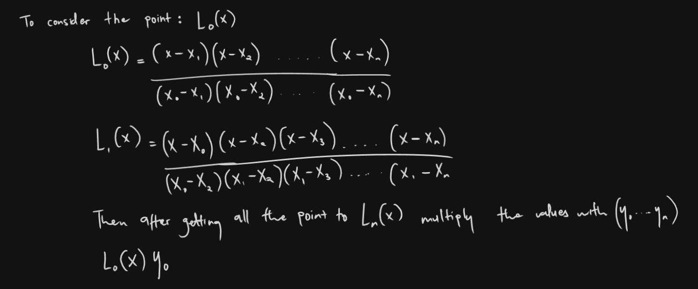

# Lagrange Interpolation

Lagrange Interpolation is a technique for creating Polynomials that passes through a certain set of data points.

The resulting Polynomial is known as the Lagrange Interpolation Polynomial.

### Properties of the Lagrange Polynomials
- Degree: The Degree of P(x) is at most n
- Uniqueness: There is a unique Polynomial of degree n that passes through the n + 1 points.

### Applications 

- It is especially useful for numerical analysis, computer graphics, data fitting applications and of course in ellipctic curve cryptography

### How it Works


In practice consider:


### Example 1


we can the verify the points by substituting the value x in our Points

### Example Rust Implementation

```rust
fn main() {
    let points = vec![(1, 2), (3, 6), (5, 10)];
    let x = 5;

    let result = lagrange_interpolation(points, x);
    println!("Interpolated value at x = {} is {}", x, result);
    
}

fn lagrange_interpolation(points: Vec<(i32,i32)>, x: i32) -> f64 {
    let mut result = 0.0;

    for ( x_i, y_i ) in &points {
        let mut l_i = 1.0;

        for ( x_j, _ ) in &points {
            if x_i != x_j {
                l_i *= (x as f64 - *x_j as f64) / (*x_i as f64 - *x_j as f64);
            }
        }

        result += *y_i as f64 * l_i;
    }

    result
}

```