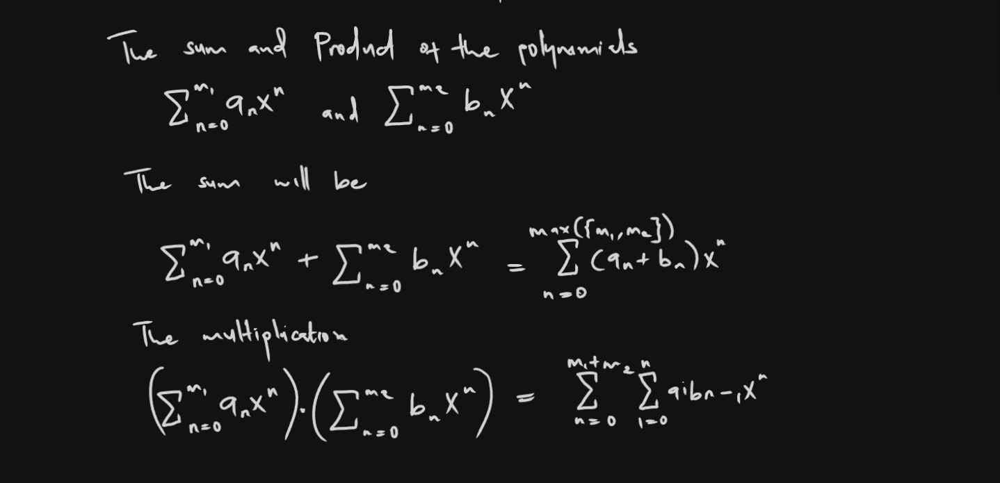
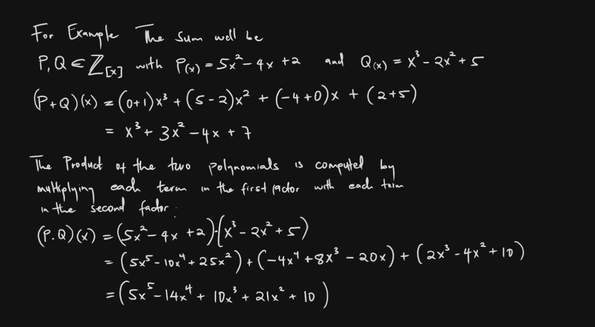

# Polynomial Arithmetic in Rust

This is a simple rust program that calculates the sum of two polynomials. This program will represent polynomials as vectors of coefficients and provide functionality to add them together

## How it Works

Polynomials behave like integers in many ways. They can be multiplied, added and subtracted.

### For Example 


In practice this would be:


## Example Rust Implementation

1. Prompts the user to enter coefficients for two polynomials
2. It adds the two polynomials together using the add_polynomials function
3. Prints the result in a readable format.

```rust
use std::io;

fn main() {
    println!("Enter coefficients of the first polynomial (highest degree first):");
    let poly1 = get_input_vector();

    println!("Enter coefficients of the second polynomial (highest degree first):");
    let poly2 = get_input_vector();

    let sum_poly = add_polynomials(&poly1, &poly2);

    println!("The sum of the polynomials is:");
    print_polynomial(&sum_poly);
}

fn add_polynomials(poly1: &[f64], poly2: &[f64]) -> Vec<f64> {
    let max_len = poly1.len().max(poly2.len());
    let mut result = vec![0.0; max_len];

    for (i, &coeff) in poly1.iter().rev().enumerate() {
        result[max_len - 1 - i] += coeff;
    }

    for (i, &coeff) in poly2.iter().rev().enumerate() {
        result[max_len - 1 - i] += coeff;
    }

    // Remove leading zeros
    while result.len() > 1 && result[0] == 0.0 {
        result.remove(0);
    }

    result
}

fn print_polynomial(poly: &[f64]) {
    for (i, &coeff) in poly.iter().enumerate() {
        let power = poly.len() - 1 - i;
        if coeff != 0.0 {
            if i > 0 && coeff > 0.0 {
                print!(" + ");
            } else if coeff < 0.0 {
                print!(" - ");
            }
            let abs_coeff = coeff.abs();
            if abs_coeff != 1.0 || power == 0 {
                print!("{}", abs_coeff);
            }
            if power > 0 {
                print!("x");
                if power > 1 {
                    print!("^{}", power);
                }
            }
        }
    }
    println!();
}

fn get_input_vector() -> Vec<f64> {
    let mut input = String::new();
    io::stdin().read_line(&mut input).expect("Failed to read line");
    input
        .trim()
        .split_whitespace()
        .map(|s| s.parse().expect("Invalid number"))
        .collect()
}
```

A brief explanation of the key functions

- `add_polynomials`: This function takes two slices of f64 (representing the coefficients of two polynomials) and returns a new Vec<f64> representing their sum. It handles polynomials of different degrees by padding the shorter one with zeros.

- `print_polynomial`: This function takes a slice of f64 and prints it in a human-readable polynomial format. It handles special cases like coefficients of 1 or -1, and doesn't print terms with zero coefficients.

- `get_input_vector`: This function reads a line of input from the user, splits it into whitespace-separated tokens, and parses each token as an f64.

## Example Usage

### To find the Sum of Two Polynomials, run the program:

```shell
cargo run
```
### Then input coefficients
- First polynomial: 2 3 1 (representing 2x^2 + 3x + 1)
- Second polynomial: 1 -1 (representing x - 1)

### Output
```markdown
The program will output: 2x^2 + 4x
```
